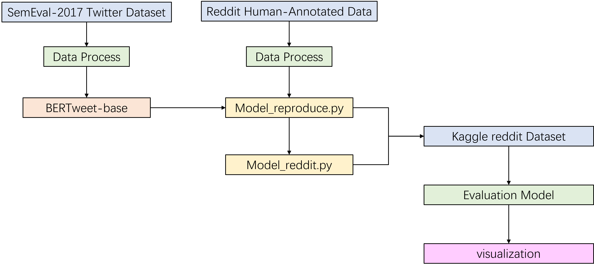

# Report Overview: Sentiment Classification with BERTweet

This report explores the sentiment classification component of the **BERTweet** paper:  
📄 [BERTweet: A pre-trained language model for English Tweets (arXiv)](https://arxiv.org/abs/2005.10200)

---

## Architecture

## Reproducing Sentiment Classification from the Paper

I reproduced the sentiment classification task from the paper using the **SemEval-2017 Task 4** dataset:  
📚 [SemEval-2017 Task 4 - Sentiment Analysis in Twitter](https://alt.qcri.org/semeval2017/task4/)

The reproduced model achieved an **F1-score of 71%**, which is close to the **78.2%** reported in the original paper.

---

## Transfer Learning from Twitter to Reddit

To explore domain adaptation, I performed transfer learning by adapting the original Twitter-based **BERTweet** model to work with **Reddit** data.

🔄 Transfer learning dataset used:  
[Kaggle: Sentiment Analysis of Reddit Data](https://www.kaggle.com/code/amarsharma768/sentiment-analysis-of-reddit-data)

After fine-tuning on Reddit data, the model achieved a **macro average F1-score of 0.93**.

---

## Comparing Reproduced and Transfer Learning Models on New Reddit Data

For evaluation, I compared the original reproduced model and the Reddit-fine-tuned model (`model_reddit`) on a new Reddit dataset:  
🧪 [Hugging Face: The Reddit Dataset (SocialGrep)](https://huggingface.co/datasets/SocialGrep/the-reddit-dataset-dataset)

The transfer learning model (`model_reddit`) showed **significant improvements** in **accuracy** and **F1-scores** compared to the reproduced Twitter-based model.

---

## Summary

| Model            | Dataset                        | F1-Score |
|------------------|--------------------------------|----------|
| Reproduced       | SemEval-2017 Task 4 (Twitter)  | 71%      |
| Paper (Reference)| SemEval-2017 Task 4 (Twitter)  | 78.2%    |
| Transfer Learned | Reddit (Kaggle)                | 93%      |

---

## References

1. [BERTweet Paper (arXiv)](https://arxiv.org/abs/2005.10200)  
2. [SemEval-2017 Task 4 Dataset](https://alt.qcri.org/semeval2017/task4/)  
3. [Reddit Training Dataset (Kaggle)](https://www.kaggle.com/code/amarsharma768/sentiment-analysis-of-reddit-data)  
4. [Reddit Testing Dataset (HuggingFace)](https://huggingface.co/datasets/SocialGrep/the-reddit-dataset-dataset)

---
