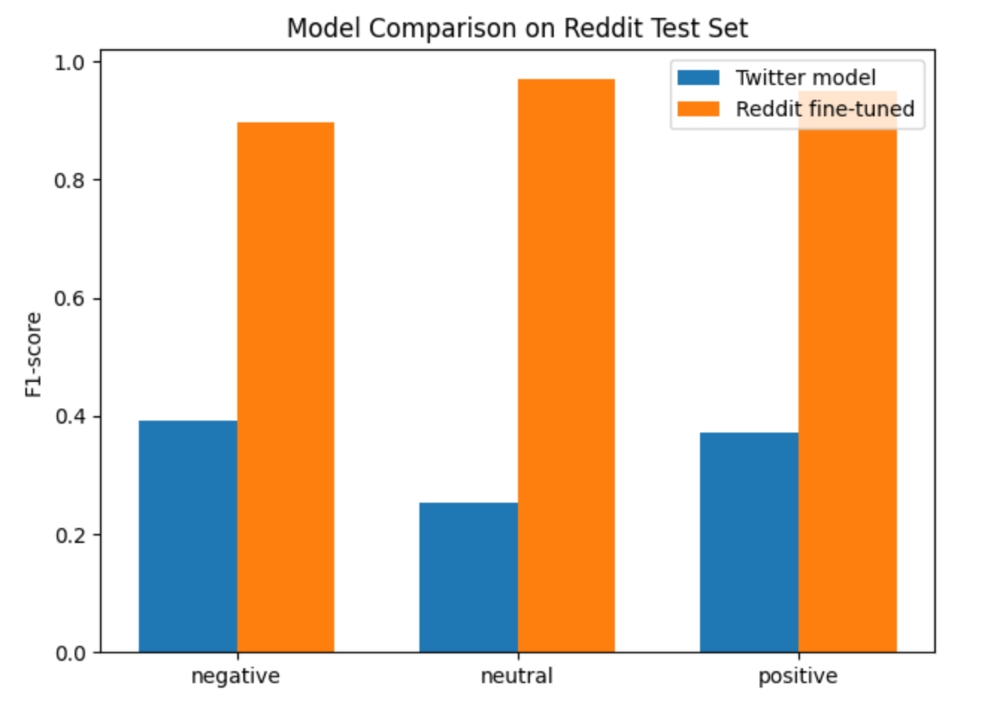

# Report Overview: Sentiment Classification with BERTweet

This project investigates sentiment classification using the pre-trained language model **BERTweet**, focusing on both reproduction of existing results and domain adaptation. The work is divided into three phases: replicating performance on Twitter data, fine-tuning on Reddit data, and evaluating cross-domain generalization.

---

## Architecture Overview

The workflow comprises the following three components:

1. **Reproduction Phase**: Reimplementation of the original BERTweet-based sentiment classifier as described in the [BERTweet paper](https://arxiv.org/abs/2005.10200), using the **SemEval-2017 Task 4** Twitter dataset.
2. **Domain Adaptation Phase**: Fine-tuning the reproduced model on the Reddit sentiment dataset from [LingoIITGN/reddit-sentiment-model-hubs](https://huggingface.co/datasets/LingoIITGN/reddit-sentiment-model-hubs) to evaluate cross-platform robustness.
3. **Cross-Domain Evaluation**: Comparative analysis using a held-out Reddit dataset from [Kaggle](https://www.kaggle.com/datasets/cosmos98/twitter-and-reddit-sentimental-analysis-dataset?resource=download), independent of the training set.

---

## Phase 1: Reproducing Twitter-Based Sentiment Classification

The initial phase replicates the sentiment classification pipeline described in:

- **Paper**: [BERTweet: A Pre-trained Language Model for English Tweets (arXiv)](https://arxiv.org/abs/2005.10200)  
- **Dataset**: [SemEval-2017 Task 4](https://alt.qcri.org/semeval2017/task4/)

The reproduced model achieved an **F1-score of 71%**, which is reasonably close to the **78.2%** score reported in the original publication. The discrepancy may be attributed to differences in training settings or evaluation metrics, which are discussed in the notebook.

---

## Phase 2: Transfer Learning from Twitter to Reddit

In the second phase, the same architecture was fine-tuned using a Reddit-based dataset:

- **Dataset**: [LingoIITGN/reddit-sentiment-model-hubs](https://huggingface.co/datasets/LingoIITGN/reddit-sentiment-model-hubs)

This phase aimed to assess the portability of BERTweet across social media platforms. The adapted model achieved a **macro-average F1-score of 0.93**, indicating strong generalization to a different linguistic context.

---

## Phase 3: Cross-Domain Evaluation and Comparative Analysis

To validate the transferability of the model, both the original Twitter-trained model and the Reddit-adapted model were evaluated on a third-party, human-annotated Reddit dataset:

- **Evaluation Dataset**: [Kaggle: Twitter and Reddit Sentimental Analysis Dataset](https://www.kaggle.com/datasets/cosmos98/twitter-and-reddit-sentimental-analysis-dataset?resource=download)

### Observations:

- The Reddit-fine-tuned model significantly outperformed the Twitter-based model across all metrics.
- This highlights the importance of domain alignment in sentiment classification tasks.
- Despite BERTweet being optimized for tweets, its transfer learning capacity enables high performance when fine-tuned appropriately.

  

---

## Performance Summary

| Model              | Training Dataset                  | Evaluation Dataset         | F1-Score |
|--------------------|-----------------------------------|-----------------------------|----------|
| Reproduced         | SemEval-2017 Task 4 (Twitter)     | Reddit (SocialGrep)         | 0.39–0.40 |
| Reference (Paper)  | SemEval-2017 Task 4 (Twitter)     | Same                        | 0.782     |
| Transfer Learned   | Reddit (Kaggle)                   | Reddit (SocialGrep)         | 0.93      |

---

## Reflections

This project demonstrates that:

- Reproduction of pre-trained language models can approximate published performance with minor discrepancies.
- Transfer learning significantly improves sentiment classification performance when adapting to a new domain (Twitter → Reddit).
- Evaluation on unseen Reddit data underscores the necessity of in-domain fine-tuning for social media text analysis.

---

## References

1. Nguyen, D. Q., Vu, T., & Tuan Nguyen, A. (2020). [BERTweet: A Pre-trained Language Model for English Tweets](https://arxiv.org/abs/2005.10200). *arXiv preprint arXiv:2005.10200*.
2. [SemEval-2017 Task 4 Dataset](https://alt.qcri.org/semeval2017/task4/)
3. [Reddit Training Dataset (HuggingFace)](https://huggingface.co/datasets/LingoIITGN/reddit-sentiment-model-hubs)
4. [Reddit Testing Dataset (Kaggle)](https://www.kaggle.com/datasets/cosmos98/twitter-and-reddit-sentimental-analysis-dataset?resource=download)

---
